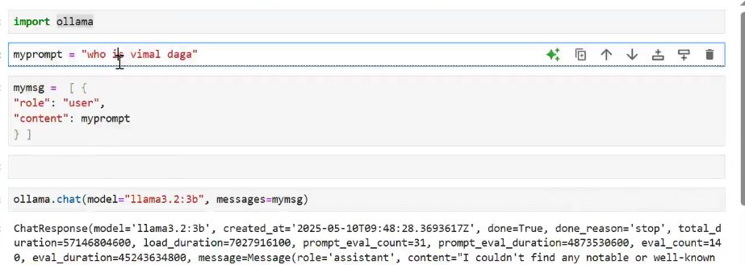
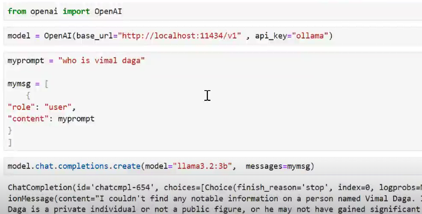

# generative-ai-notes

#### need to look up session-4 "starting 30 mins"

### communicating with the local model, with the "ollama" related fucntion.

### even with the "open-ai" related function we can able to communicate with the local model or model in any location by passing the model_location to the "base_url" parameter.

### building the customised 'chat bot' with a simple-backend-script and the user-interface ( simply building with the help of the 'gadio' library of python)

## Explanation for the above picture code (about streaming respsonse explanation in detail ): -

### and remember there are 3 different kinds of roles in the world of "genrerative-ai" world
    1) system-role: - it is nothing but we are fixing in which domain we want the generic-llm-model to become expert.
                      Ex:- act like expert in 'finance'.

    2) user-role: -  'user' is nothing but the customer, here we will pass our prompt.
    3) assistent-role:- it is the genric-llm model that we are using.

### to get the analysis of the 2 pdfs usingn the gemini model:-

